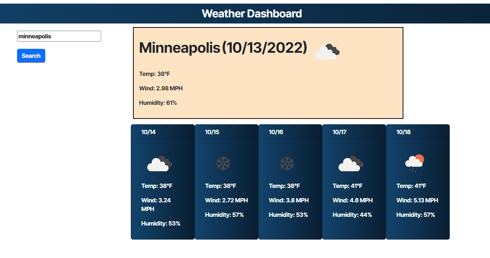

# Weather Dashboard 

## Description

Build a weather dashboard

## Installation

N/A

## Usage

URL:[https://nick-menzhuber.github.io/weather-dashboard-challenge/](https://nick-menzhuber.github.io/weather-dashboard-challenge/)

A simple weather dashboard which allows the user to enter a city name into the search field and will then present the user with the current conditions in that location (based on latitude and longitude) as well as forecasted conditions for the next 5 days. Includes icons depicting weather conditions, temperature, wind speed, and humidity readings.

## Credits

API data sourced from [https://openweathermap.org/](Open Weather)

## License

MIT License

Copyright (c) 2022 Nick-Menzhuber

Permission is hereby granted, free of charge, to any person obtaining a copy
of this software and associated documentation files (the "Software"), to deal
in the Software without restriction, including without limitation the rights
to use, copy, modify, merge, publish, distribute, sublicense, and/or sell
copies of the Software, and to permit persons to whom the Software is
furnished to do so, subject to the following conditions:

The above copyright notice and this permission notice shall be included in all
copies or substantial portions of the Software.